---
## Front matter
lang: ru-RU
title: Лабораторная работа № 1
subtitle: Введение в Mininet
author:
  - Шияпова Д.И.
institute:
  - Российский университет дружбы народов, Москва, Россия
date: 20 мая 2025

## i18n babel
babel-lang: russian
babel-otherlangs: english

## Formatting pdf
toc: false
toc-title: Содержание
slide_level: 2
aspectratio: 169
section-titles: true
theme: metropolis
header-includes:
 - \metroset{progressbar=frametitle,sectionpage=progressbar,numbering=fraction}
---

## Докладчик

:::::::::::::: {.columns align=center}
::: {.column width="70%"}

  * Шияпова Дарина Илдаровна
  * Студентка
  * Российский университет дружбы народов
  * [1132226458@pfur.ru](mailto:1132226458@pfur.ru)

:::
::: {.column width="30%"}

:::
::::::::::::::

## Цель работы

Основной целью работы является развёртывание в системе виртуализации
(например, в VirtualBox) mininet, знакомство с основными командами для работы с Mininet через командную строку и через графический интерфейс.

## Теоретическое введение

Mininet[@mininet] -- это эмулятор компьютерной сети. Под компьютерной сетью подразумеваются простые компьютеры — хосты, коммутаторы, а так же OpenFlow-контроллеры. С помощью простейшего синтаксиса в примитивном интерпретаторе команд можно разворачивать сети из произвольного количества хостов, коммутаторов в различных топологиях и все это в рамках одной виртуальной машины(ВМ). На всех хостах можно изменять сетевую конфигурацию, пользоваться стандартными утилитами(ifconfig, ping) и даже получать доступ к терминалу. На коммутаторы можно добавлять различные правила и маршрутизировать трафик.

Mininet создает реалистичную виртуальную сеть, выполняя реальный код ядра, коммутатора и приложения на одной машине (VM, облачной или собственной) за считанные секунды с помощью одной команды `sudo mn`. 

## Выполнение лабораторной работы

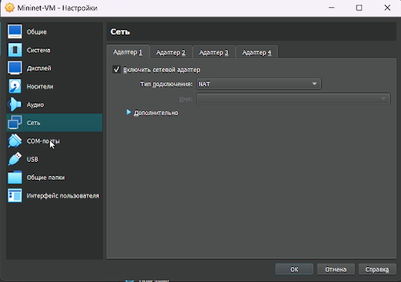{#fig:003 width=70%}

## Выполнение лабораторной работы

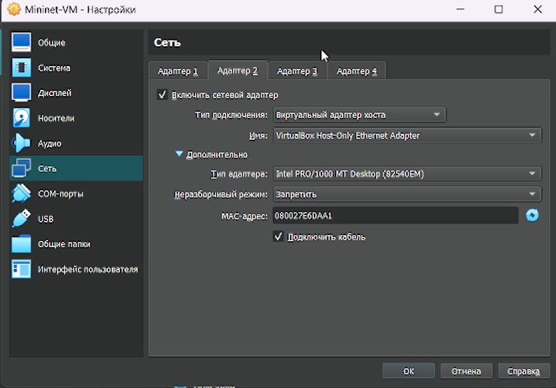{#fig:004 width=70%}

## Выполнение лабораторной работы

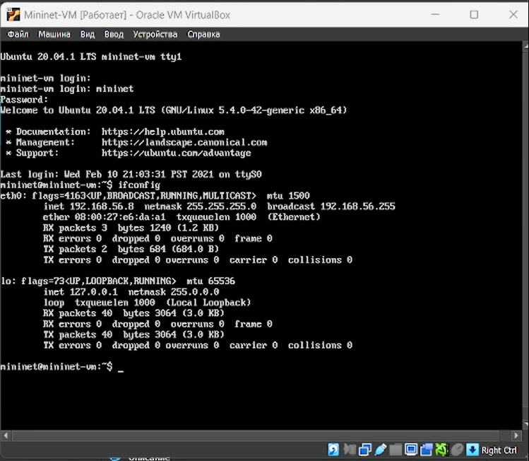{#fig:005 width=70%}

## Выполнение лабораторной работы

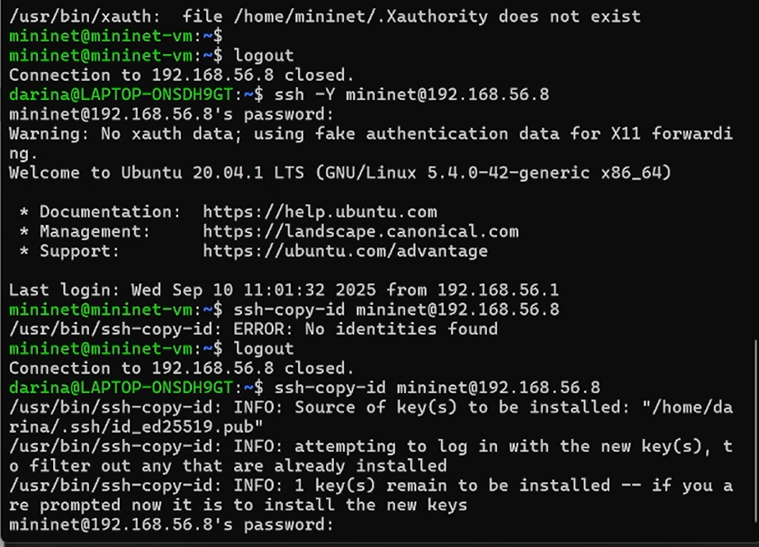{#fig:006 width=70%}

## Выполнение лабораторной работы

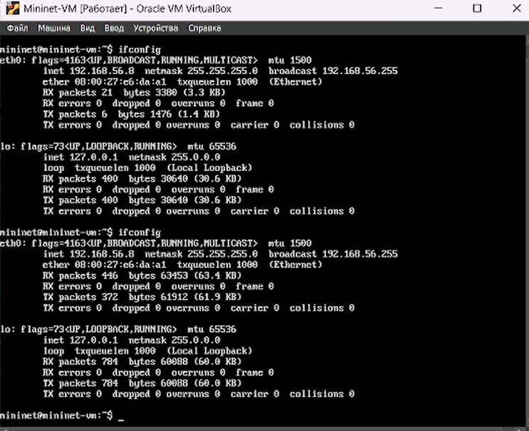{#fig:007 width=70%}

## Выполнение лабораторной работы

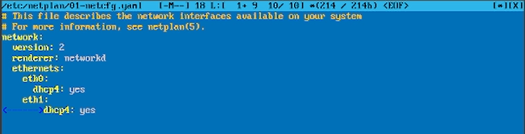{#fig:008 width=70%}

## Выполнение лабораторной работы

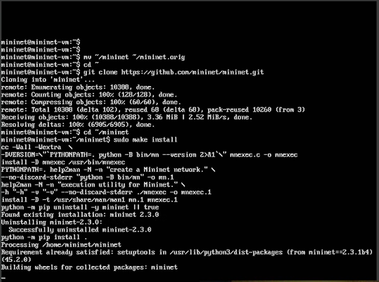{#fig:009 width=70%}

## Выполнение лабораторной работы

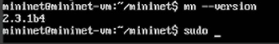{#fig:010 width=70%}

## Выполнение лабораторной работы

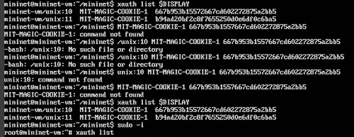{#fig:011 width=70%}

## Выполнение лабораторной работы

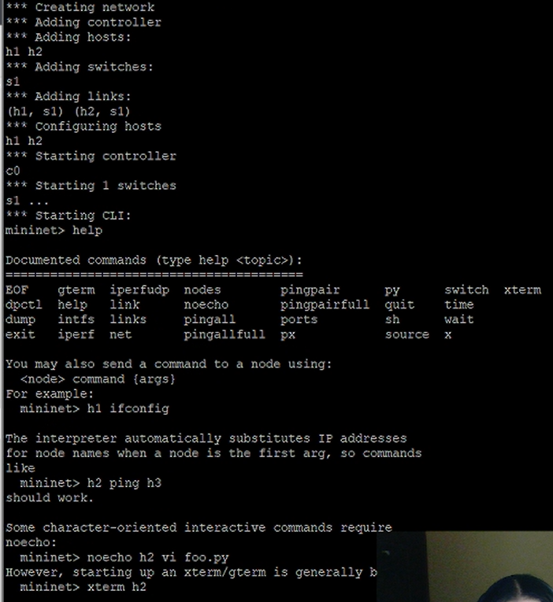{#fig:012 width=70%}

## Выполнение лабораторной работы

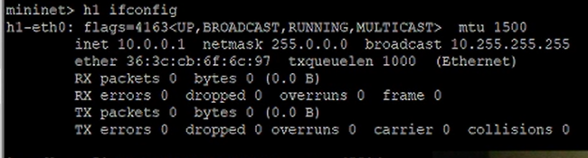{#fig:013 width=70%}

## Выполнение лабораторной работы

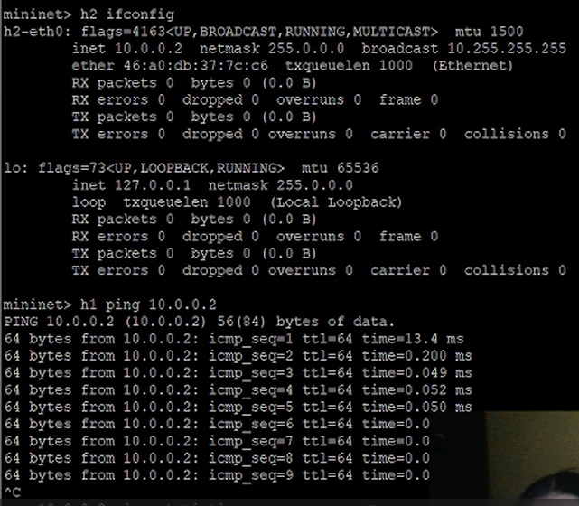{#fig:014 width=70%}

## Выполнение лабораторной работы

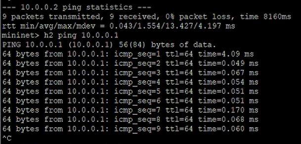{#fig:015 width=70%}

## Выполнение лабораторной работы

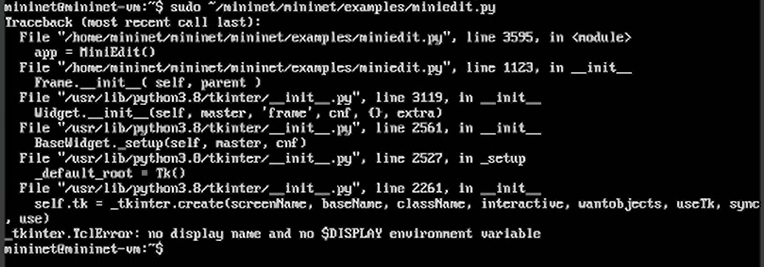{#fig:016 width=70%}

## Выполнение лабораторной работы

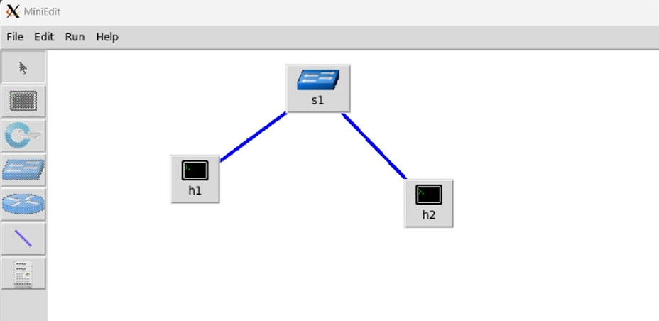{#fig:017 width=70%}

## Выводы

В результате выполнения данной лабораторной работы я развёрнула mininet в системе виртуализации
VirtualBox, а также ознакомилась с основными командами для работы с Mininet через командную строку и через графический интерфейс.

